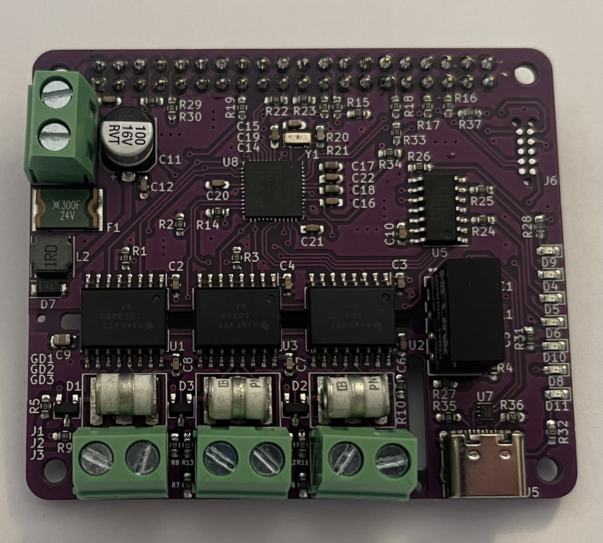

.. _control_hub:

Control Hub
##############

Overview
********

The Control Hub is ARM development
board with onboard LEDs,a range of IOs and 
a independent RS485 Isolated port

Hardware
********

- ATSAMD21G18A ARM Cortex-M0+ processor at 48 MHz
- 256 KiB flash memory and 32 KiB of RAM
- One user LEDs
- Native USB port

Supported Features
==================

The control_hub board configuration supports the following hardware
features:

+-----------+------------+------------------------------------------+
| Interface | Controller | Driver/Component                         |
+===========+============+==========================================+
| DMA       | on-chip    | Direct memory access                     |
+-----------+------------+------------------------------------------+
| DAC       | on-chip    | Digital to analogue converter            |
+-----------+------------+------------------------------------------+
| Flash     | on-chip    | Can be used with LittleFS to store files |
+-----------+------------+------------------------------------------+
| GPIO      | on-chip    | I/O ports                                |
+-----------+------------+------------------------------------------+
| HWINFO    | on-chip    | Hardware info                            |
+-----------+------------+------------------------------------------+
| NVIC      | on-chip    | nested vector interrupt controller       |
+-----------+------------+------------------------------------------+
| SPI       | on-chip    | Serial Peripheral Interface ports        |
+-----------+------------+------------------------------------------+
| I2C       | on-chip    | Inter-Integrated Circuit                 |
+-----------+------------+------------------------------------------+
| SYSTICK   | on-chip    | systick                                  |
+-----------+------------+------------------------------------------+
| USART     | on-chip    | Serial ports                             |
+-----------+------------+------------------------------------------+
| USB       | on-chip    | USB device                               |
+-----------+------------+------------------------------------------+
| WDT       | on-chip    | Watchdog                                 |
+-----------+------------+------------------------------------------+

Other hardware features are not currently supported by Zephyr.
